# Airline Booking System — Deliverables for MSS301

Hai phần bắt buộc nộp theo yêu cầu môn học:

- [Phần A · Database Design](#phần-a--database-design)
- [Phần B · Communication & Architecture Design](#phần-b--communication--architecture-design)

---

# Phần A · Database Design

## A.1. Tổng quan chiến lược dữ liệu

Hệ thống áp dụng **Database-per-Service pattern** — nguyên tắc nền tảng của microservices:

- Mỗi trong 5 microservice **sở hữu một database riêng**, không service nào được phép truy vấn trực tiếp DB của service khác.
- Tham chiếu giữa các service được lưu dưới dạng **logical foreign key** — chỉ là cột `BIGINT` (vd `user_id`, `flight_id`) không có constraint vật lý qua DB.
- Lý do: đảm bảo **loose coupling** ở tầng dữ liệu — đổi schema 1 service không break các service khác; mỗi service có thể chọn DB engine khác nhau (nhưng dự án thống nhất PostgreSQL 16 cho đơn giản).

```
┌──────────────────┐  ┌──────────────────┐  ┌──────────────────┐
│   flight_db      │  │    user_db       │  │   booking_db     │
│  6 bảng          │  │   3 bảng         │  │   3 bảng + Redis │
└──────────────────┘  └──────────────────┘  └──────────────────┘
┌──────────────────┐  ┌──────────────────┐
│   payment_db     │  │   notify_db      │
│   4 bảng         │  │   3 bảng         │
└──────────────────┘  └──────────────────┘

  Postgres 16 (cùng 1 server, 5 logical database tách biệt)
  Redis 7 (chỉ booking-service sử dụng — distributed lock cho seat-hold)
```

## A.2. ERD chi tiết từng database

### A.2.1. flight_db (flight-search-service)

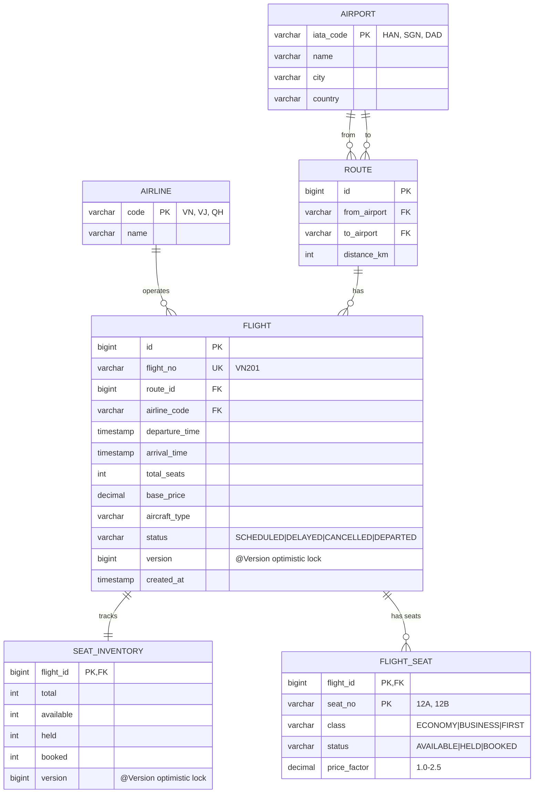

**Vai trò các bảng:**

| Bảng              | Vai trò chính                                                                |
| ----------------- | ---------------------------------------------------------------------------- |
| `airport`         | Danh mục sân bay (master data, ít thay đổi)                                   |
| `airline`         | Danh mục hãng bay                                                             |
| `route`           | Đường bay (A → B), distance dùng để tính giá / thời gian bay                  |
| `flight`          | Chuyến bay cụ thể, có ngày giờ và giá gốc                                      |
| `seat_inventory`  | Bảng đếm tổng hợp: tổng, còn trống, đang giữ, đã bán — query nhanh khi search |
| `flight_seat`     | Trạng thái từng ghế cụ thể, cần cho UI chọn ghế và chống double-book          |

### A.2.2. user_db (user-service)

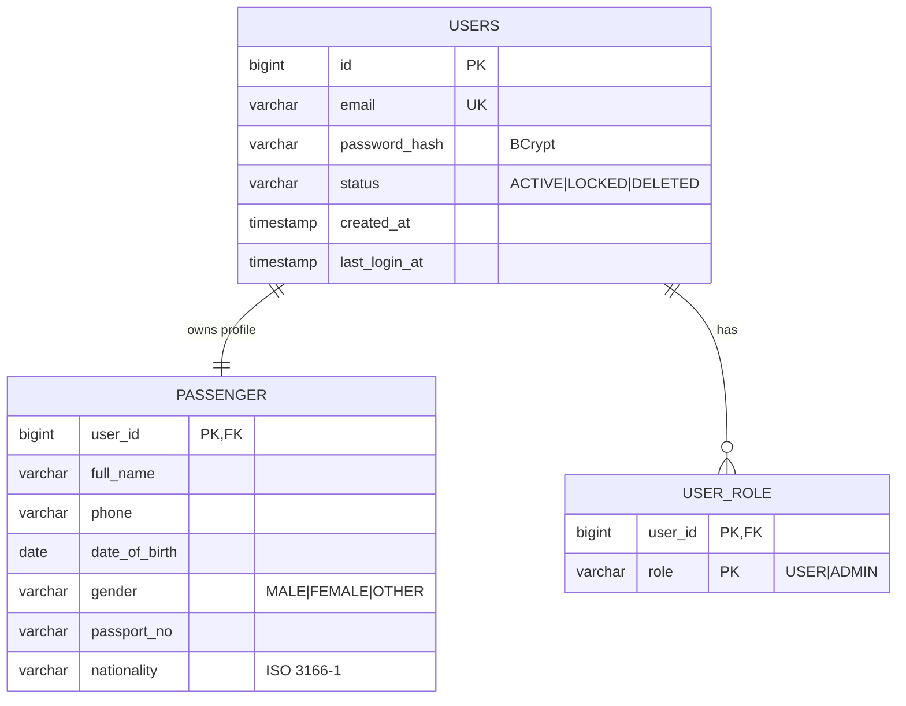

**Quyết định thiết kế:** `users` và `passenger` quan hệ 1-1, share PK (`@MapsId` trong JPA) — tách thành 2 bảng để:

- `users` chỉ chứa thông tin authentication, dễ thay đổi (đổi mật khẩu, lock account).
- `passenger` chứa thông tin hành khách (KYC) cần cho việc bay — ít thay đổi.

### A.2.3. booking_db (booking-service) ⭐ schema cốt lõi

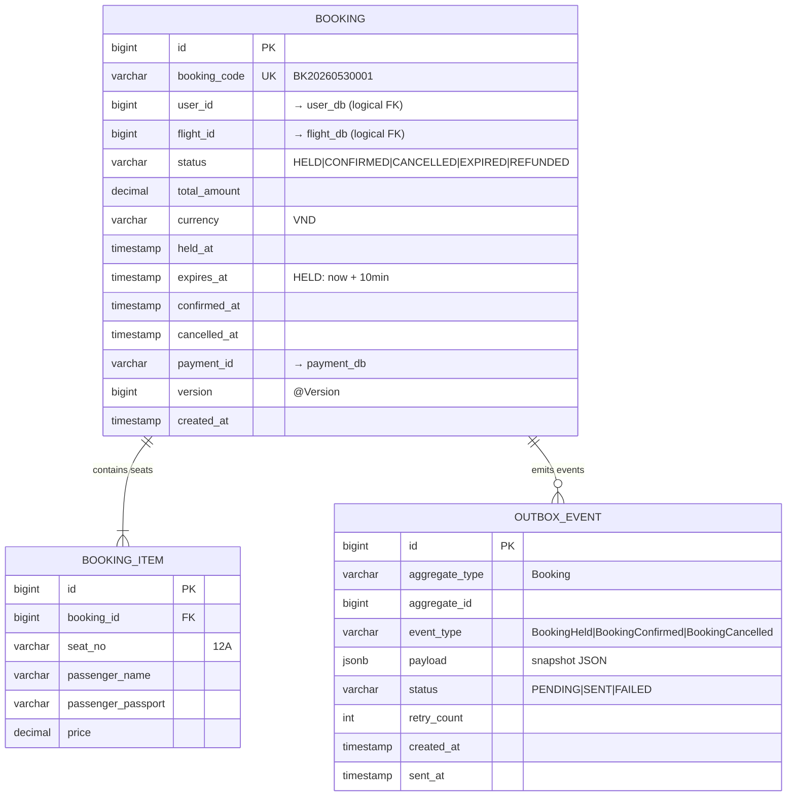

**Booking lifecycle (state machine):**

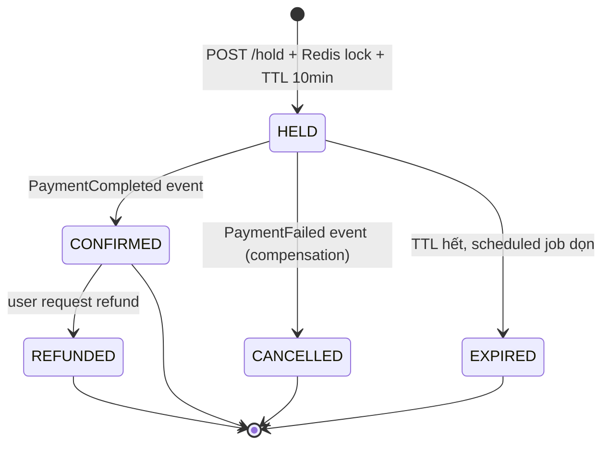

**Redis schema (đi kèm booking_db):**

| Key                           | Value                  | TTL   | Mục đích                       |
| ----------------------------- | ---------------------- | ----- | ------------------------------ |
| `seat:{flightId}:{seatNo}`    | `{bookingId,userId}`   | 10min | Distributed lock chống tranh chấp ghế |
| `idempotency:{key}`           | `{bookingId}`          | 24h   | Chống double-submit            |
| `flight:price:{flightId}`     | `{currentPrice}`       | 5min  | Cache giá đã tính              |

### A.2.4. payment_db (payment-service)

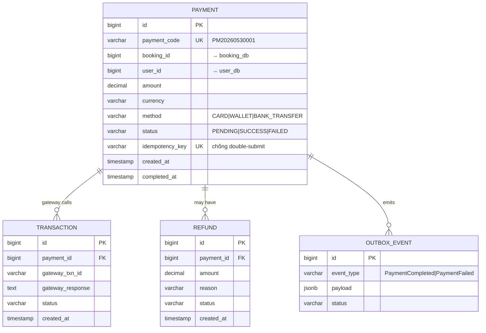

**Tại sao tách `payment` và `transaction`?** Một `payment` có thể có nhiều lần thử (retry) → mỗi lần gọi gateway lưu 1 `transaction` để audit; trạng thái cuối ở `payment.status`.

### A.2.5. notify_db (notification-service)

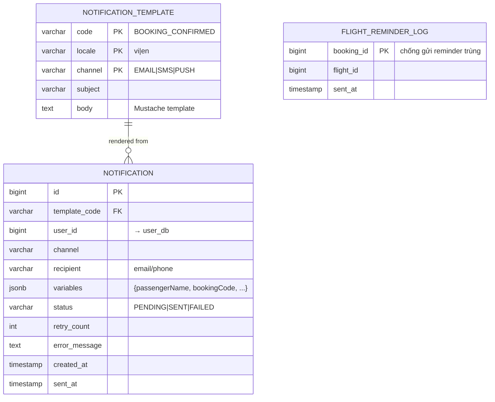

## A.3. Mapping bảng ↔ chức năng nghiệp vụ

| Use case nghiệp vụ              | Bảng được ghi vào                                                          |
| ------------------------------- | --------------------------------------------------------------------------- |
| Đăng ký tài khoản                | `users`, `passenger`, `user_role`                                          |
| Search flight                    | (read only) `flight`, `route`, `seat_inventory`                            |
| Hold seat ⭐                     | `booking` (status=HELD), `booking_item`, `outbox_event` (booking_db); Redis SETNX |
| Make payment                     | `payment` (status=PENDING), `transaction` (gateway call), `outbox_event` (payment_db) |
| Confirm booking (saga step)      | `booking` (HELD → CONFIRMED), `outbox_event` — triggered by PaymentCompleted |
| Cancel/compensation              | `booking` (CANCELLED), `refund`, `outbox_event` × 2 (booking + payment)     |
| Release expired hold (cron)      | `booking` (HELD → EXPIRED), release Redis key                              |
| Send booking confirmation email  | `notification` (PENDING → SENT) — render từ `notification_template`         |
| Send flight reminder (cron)      | `notification`, `flight_reminder_log` (chống gửi trùng)                     |

## A.4. Concurrency Strategy — chống double-booking

Đây là **bài toán quan trọng nhất** của đề tài. Dùng **2 lớp bảo vệ chồng nhau**:

```
   Lớp 1 — Redis Distributed Lock (nhanh, < 1 ms)
   ─────────────────────────────────────────────────
   SETNX seat:{flightId}:{seatNo}  TTL=10min  → atomic
        ↓ thắng
        ↓
   Lớp 2 — Database Optimistic Locking (backup)
   ─────────────────────────────────────────────────
   UPDATE booking SET ... WHERE id=? AND version=?
   UNIQUE INDEX (booking_id, seat_no) ON booking_item
        ↓
   INSERT booking, INSERT booking_item — atomic transaction
```

**Tại sao cần cả 2 lớp?**

- Redis nhanh nhưng có thể bị flush / lose memory.
- DB optimistic lock chậm hơn nhưng an toàn tuyệt đối.
- Khi cả 2 cùng hoạt động: hiệu năng cao + đảm bảo correctness.

## A.5. Các quyết định thiết kế DB quan trọng

| Quyết định                                                          | Lý do                                                                             |
| ------------------------------------------------------------------- | --------------------------------------------------------------------------------- |
| `@Version` trên Flight, SeatInventory, Booking                       | Optimistic locking — chống lost update khi concurrent write                       |
| Partial index `WHERE status = 'HELD'` trên `booking.expires_at`      | Job scan expired booking chạy nhanh, index nhỏ hơn ~80%                            |
| `outbox_event` (JSONB payload) ở booking + payment                   | Outbox pattern — at-least-once delivery cho Kafka (không mất event)                |
| `idempotency_key` UNIQUE trên `payment`                              | Chống double-submit khi user bấm Pay 2 lần                                          |
| `CHECK CONSTRAINT` cho mọi cột enum                                  | Type safety ở DB level — tránh corrupt data do bug code                            |
| `BIGINT user_id` (logical FK, không có constraint)                   | Tuân thủ Database-per-Service — services độc lập về schema                          |
| `flight_seat` riêng + bảng đếm `seat_inventory`                      | Tách giữa "trạng thái từng ghế" và "tổng hợp đếm" để query search bay nhanh         |
| Flyway migrations (`V1__init_schema.sql`, …)                         | Schema được version hoá, deploy lặp lại được, dễ rollback                           |
| `notification_template` có composite PK (code, locale, channel)      | Hỗ trợ đa ngôn ngữ + đa kênh (Email, SMS) — chỉ cần thêm row mới, không phải code   |

---

# Phần B · Communication & Architecture Design

## B.1. Kiến trúc tổng quan

Hệ thống áp dụng **Microservices Architecture** với các nguyên tắc:

| Nguyên tắc                       | Thực thi trong dự án                                                       |
| -------------------------------- | -------------------------------------------------------------------------- |
| Single Responsibility per service | Mỗi service phụ trách 1 bounded context: flight, user, booking, payment, notification |
| Database-per-Service              | 5 DB tách biệt, không cross-DB query                                       |
| API Gateway as single entrypoint  | `api-gateway` :8080 — định tuyến, xác thực JWT, rate-limit                  |
| Independent deployment            | Mỗi service có Dockerfile riêng, deploy độc lập, không break service khác   |
| Polyglot persistence              | Postgres cho hầu hết; Redis cho distributed lock (booking-service)          |
| Event-driven where appropriate    | Kafka cho event bất đồng bộ (booking, payment, notification)                |

## B.2. Container Diagram

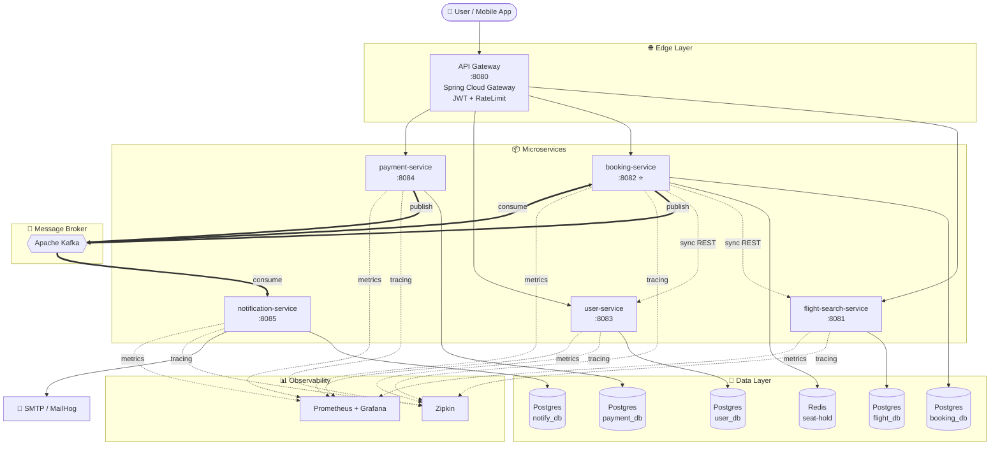

## B.3. Mô tả từng service

| Service                  | Port  | Domain Responsibility                                                    | Sync Calls In        | Sync Calls Out                | Events Published                                          | Events Consumed                            |
| ------------------------ | ----- | ------------------------------------------------------------------------ | -------------------- | ----------------------------- | --------------------------------------------------------- | ------------------------------------------ |
| **api-gateway**          | 8080  | Routing, authentication, rate-limit                                       | All client requests  | Tất cả 5 services             | —                                                         | —                                          |
| **flight-search-service**| 8081  | Lịch chuyến bay, đường bay, sân bay, ghế khả dụng                         | API Gateway, booking | —                             | —                                                         | —                                          |
| **booking-service** ⭐    | 8082  | Giữ ghế (hold), xác nhận booking, hủy booking                            | API Gateway          | flight-search, user           | `booking.held`, `booking.confirmed`, `booking.cancelled`  | `payment.completed`, `payment.failed`      |
| **user-service**         | 8083  | Đăng ký, đăng nhập, JWT, hồ sơ hành khách                                 | API Gateway, booking | —                             | `user.registered`                                          | —                                          |
| **payment-service**      | 8084  | Xử lý thanh toán, hoàn tiền                                              | API Gateway          | (gọi mock payment gateway)    | `payment.completed`, `payment.failed`, `refund.completed` | `booking.held` (theo dõi để biết cần pay)  |
| **notification-service** | 8085  | Gửi email/SMS xác nhận, nhắc nhở                                          | —                    | (gọi SMTP/SMS provider)       | —                                                         | `booking.confirmed`, `booking.cancelled`, `payment.failed` |

## B.4. Communication Patterns — chi tiết

### B.4.1. Synchronous Communication (REST over HTTP/JSON)

**Khi nào dùng:** Caller cần kết quả ngay lập tức để tiếp tục logic.

**Ví dụ luồng:**

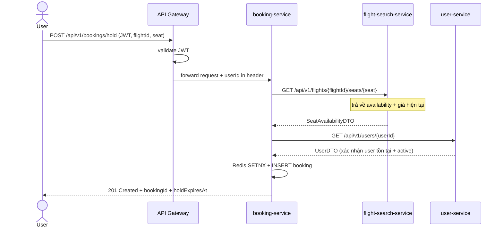

**Đặc điểm:**

- Dùng `RestTemplate` (đã setup trong base code) — có thể nâng cấp lên **OpenFeign** ở phase Tuần 6 để code declarative hơn.
- Mọi call đều có **timeout 3 giây** và bọc bởi **Circuit Breaker** (Resilience4j).
- DTO định nghĩa rõ trong `shared/common-web` module để cả 2 phía cùng dùng.

### B.4.2. Asynchronous Communication (Apache Kafka)

**Khi nào dùng:** Caller không cần đợi kết quả ngay; nhiều consumer cùng phản ứng với 1 event.

**Topic design:**

| Topic                  | Producer       | Consumer(s)                  | Partition Key | Purpose                                       |
| ---------------------- | -------------- | ---------------------------- | ------------- | --------------------------------------------- |
| `booking.held`         | booking-svc    | payment-svc                  | `bookingId`   | Báo cho payment biết có booking chờ pay        |
| `booking.confirmed`    | booking-svc    | notification-svc             | `bookingId`   | Trigger gửi email xác nhận                     |
| `booking.cancelled`    | booking-svc    | notification-svc             | `bookingId`   | Trigger gửi email hủy                          |
| `payment.completed`    | payment-svc    | booking-svc                  | `bookingId`   | Báo booking confirm chính thức                 |
| `payment.failed`       | payment-svc    | booking-svc, notification-svc | `bookingId`   | Trigger compensation: hủy booking + email fail |

**Tại sao partition theo `bookingId`?** Đảm bảo tất cả event của cùng 1 booking đi vào cùng 1 partition → consumer xử lý theo thứ tự đúng (held → completed → confirmed), tránh race condition.

**Event payload schema (chia sẻ qua `shared/common-web`):**

```java
public record BookingHeldEvent(
    Long bookingId,
    String bookingCode,
    Long userId,
    Long flightId,
    String seatNo,
    BigDecimal amount,
    String currency,
    Instant heldAt,
    Instant expiresAt
) {}

public record PaymentCompletedEvent(
    Long paymentId,
    String paymentCode,
    Long bookingId,
    Long userId,
    BigDecimal amount,
    Instant completedAt
) {}
```

### B.4.3. So sánh và quyết định

| Tiêu chí                | Sync (REST)                              | Async (Kafka)                             |
| ----------------------- | ---------------------------------------- | ----------------------------------------- |
| Latency                 | Thấp (real-time)                          | Cao hơn (eventually consistent)           |
| Coupling                | Tight — caller phụ thuộc availability của callee | Loose — producer không cần biết consumer |
| Failure handling        | Caller thấy lỗi ngay → Circuit Breaker    | Retry tự động qua broker                  |
| Use case phù hợp        | Query, validate, lock seat                | Notify, cập nhật trạng thái xuyên service |
| Trade-off               | Cascade failure nếu callee chết           | Khó debug hơn (event eventual)            |

→ **Quyết định:** Sync cho luồng critical-path đặt vé (hold seat), Async cho luồng background (payment confirm → notify, compensation).

## B.5. Pattern cốt lõi — chi tiết triển khai

### B.5.1. Saga (Choreography) — đảm bảo nhất quán Booking ↔ Payment

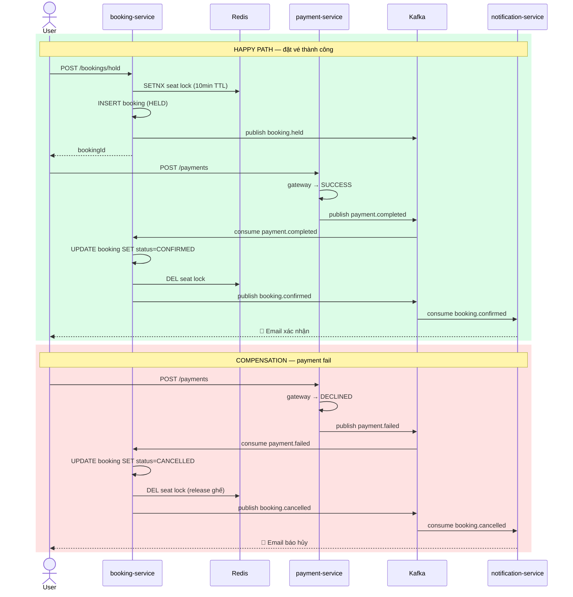

**Tại sao chọn Choreography thay vì Orchestration?**

- Phù hợp với dự án nhỏ — không có orchestrator (Camunda, Temporal) phức tạp.
- Mỗi service tự biết phải làm gì khi nhận event → loose coupling tối đa.
- Hợp với hành vi thực tế: payment xong → tự nhiên booking confirm, không cần ai chỉ huy.

### B.5.2. Outbox Pattern — đảm bảo at-least-once delivery

**Vấn đề:** Nếu code publish trực tiếp lên Kafka trong transaction:

```java
@Transactional
void hold(...) {
    bookingRepo.save(booking);     // commit DB
    kafkaTemplate.send(event);     // ← nếu Kafka down → event bị mất, DB đã commit!
}
```

**Giải pháp Outbox:**

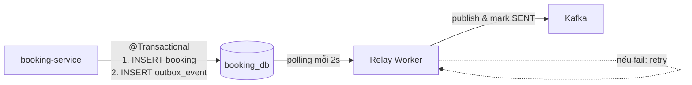

Code:

```java
@Transactional
void hold(...) {
    var booking = bookingRepo.save(...);
    outboxRepo.save(new OutboxEvent(
        "Booking", booking.getId(), "BookingHeldEvent",
        toJson(payload), PENDING
    ));
    // commit cả 2 cùng nhau — atomic
}

@Scheduled(fixedDelay = 2000)
void relay() {
    outboxRepo.findByStatus(PENDING, pageable)
        .forEach(evt -> {
            try {
                kafka.send(evt.getEventType(), evt.getPayload());
                evt.setStatus(SENT);
                evt.setSentAt(now());
            } catch (Exception e) {
                evt.setRetryCount(evt.getRetryCount() + 1);
            }
            outboxRepo.save(evt);
        });
}
```

### B.5.3. Concurrent Booking Resolution — 2 lớp

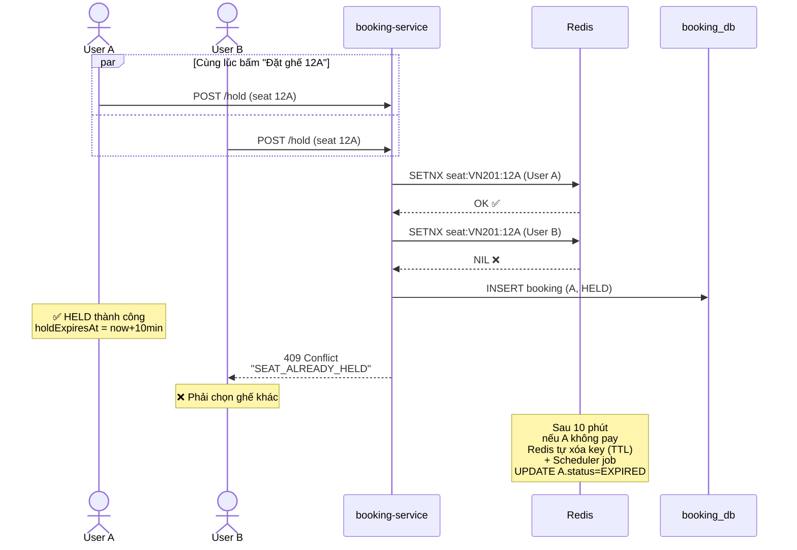

### B.5.4. Resilience — Circuit Breaker (Resilience4j)

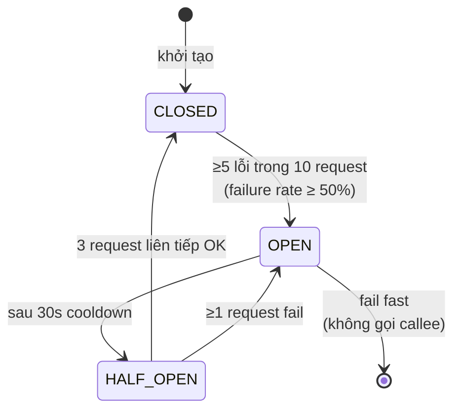

Cấu hình mẫu cho `booking-service` khi gọi `flight-search-service`:

```yaml
resilience4j:
  circuitbreaker:
    instances:
      flightService:
        failure-rate-threshold: 50
        sliding-window-size: 10
        wait-duration-in-open-state: 30s
        permitted-number-of-calls-in-half-open-state: 3
  timelimiter:
    instances:
      flightService:
        timeout-duration: 3s
  retry:
    instances:
      flightService:
        max-attempts: 3
        wait-duration: 500ms
        exponential-backoff-multiplier: 2
```

### B.5.5. Observability Stack

```
                ┌───────────────────────┐
                │   Microservice (×5)   │
                │  ─────────────────    │
                │  Micrometer           │
                │  + Spring Actuator    │
                └─────┬─────────┬───────┘
                      │         │
        /actuator/    │         │   /actuator/health
        prometheus    │         │   /actuator/info
                      ▼         ▼
              ┌─────────────┐ ┌──────────┐
              │ Prometheus  │ │ Zipkin   │
              │ (metrics)   │ │ (traces) │
              └──────┬──────┘ └──────────┘
                     │
                     ▼
               ┌──────────┐
               │ Grafana  │  ◄── dashboard cho ops
               └──────────┘
```

- **Health:** `/actuator/health` — kiểm tra DB, Redis, Kafka connection.
- **Metrics:** request rate, error rate, p50/p95/p99 latency mỗi endpoint.
- **Tracing:** mỗi request có `traceId`/`spanId` xuyên 5 service → debug 1 lượt booking dễ dàng.
- **Logging:** Logback JSON format kèm `traceId` để LogQL query.

## B.6. API Gateway routing

| Path pattern                | Forward to                                    | Filters                                        |
| --------------------------- | --------------------------------------------- | ---------------------------------------------- |
| `/api/v1/users/**`          | http://user-service:8083                      | RateLimit (10 req/s), no auth cần cho /register, /login |
| `/api/v1/flights/**`        | http://flight-search-service:8081             | RateLimit (50 req/s), public                   |
| `/api/v1/bookings/**`       | http://booking-service:8082                   | JwtAuthFilter, RateLimit (20 req/s)            |
| `/api/v1/payments/**`       | http://payment-service:8084                   | JwtAuthFilter, RateLimit (5 req/s), Idempotency check |

## B.7. Deployment Topology (Docker Compose for dev)

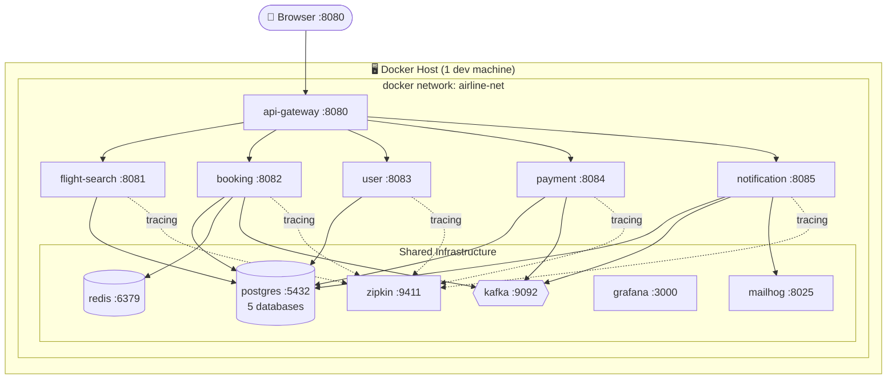

## B.8. Tổng kết các quyết định kiến trúc (ADR)

| #  | Quyết định                                                     | Lý do                                                                |
| -- | -------------------------------------------------------------- | -------------------------------------------------------------------- |
| 1  | Microservices (5 service riêng) thay vì monolith               | Phù hợp đề bài, mỗi member có 1 service rõ ràng để focus              |
| 2  | Database-per-Service                                            | Loose coupling ở tầng dữ liệu, dễ scale độc lập                      |
| 3  | API Gateway làm single entrypoint                              | Tập trung auth/rate-limit, ẩn topology service nội bộ                  |
| 4  | Sync REST + Async Kafka (kết hợp)                              | Phù hợp use case: sync cho critical path, async cho event             |
| 5  | Choreography Saga (không orchestrator)                          | Đủ đơn giản cho dự án; loose coupling cao nhất                       |
| 6  | Outbox Pattern                                                  | Đảm bảo at-least-once delivery cho Kafka, không bị mất event          |
| 7  | Redis distributed lock + DB optimistic lock (2 lớp)             | Hiệu năng cao (Redis < 1ms) + an toàn tuyệt đối (DB UNIQUE)           |
| 8  | Resilience4j Circuit Breaker                                    | Tránh cascade failure khi 1 service chết                              |
| 9  | Spring Cloud Gateway (reactive) làm API Gateway                 | Native cho Spring ecosystem, perf cao                                  |
| 10 | Postgres 16 cho tất cả service                                  | Đơn giản hoá ops; vẫn đảm bảo logical separation                     |
| 11 | Flyway migration thay vì Hibernate ddl-auto                     | Schema có lịch sử, deploy production an toàn                          |
| 12 | Distributed tracing với Micrometer + Zipkin                     | Debug 1 request qua 5 service dễ dàng                                  |

---

## Phụ lục — Cách dùng tài liệu này

1. **Phần A** copy vào mục "Database Design" trong file `.docx` template.
2. **Phần B** copy vào mục "System Architecture" trong file `.docx` template.
3. Các Mermaid diagram (block ```mermaid```) có thể:
   - Mở trong VS Code (cài extension "Markdown Preview Mermaid Support") → screenshot → paste vào Word.
   - Hoặc paste code vào https://mermaid.live → export PNG/SVG → chèn Word.
4. Các ERD và sequence diagram đã được vẽ theo notation chuẩn → giảng viên đọc được ngay.
