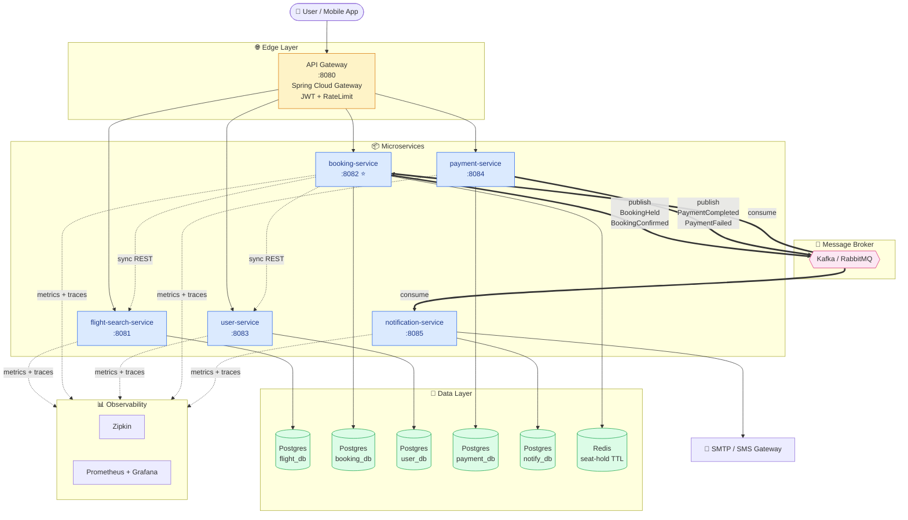
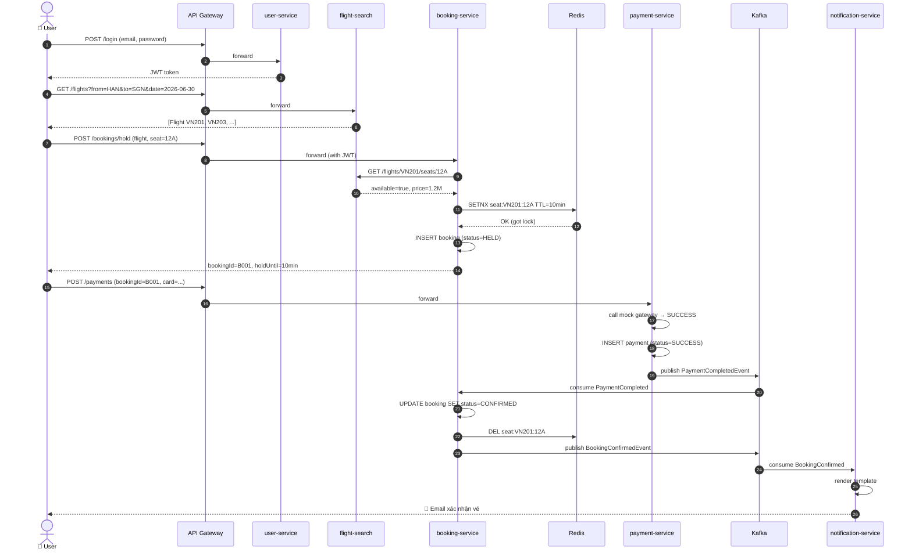
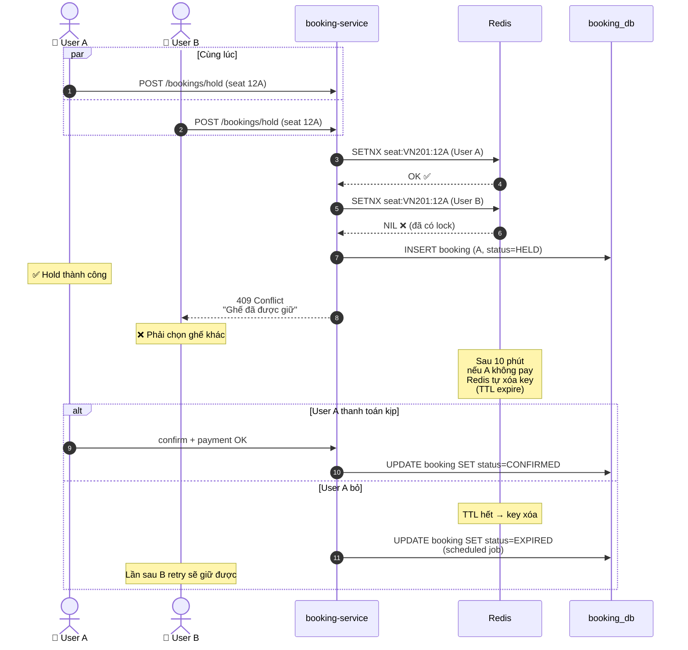
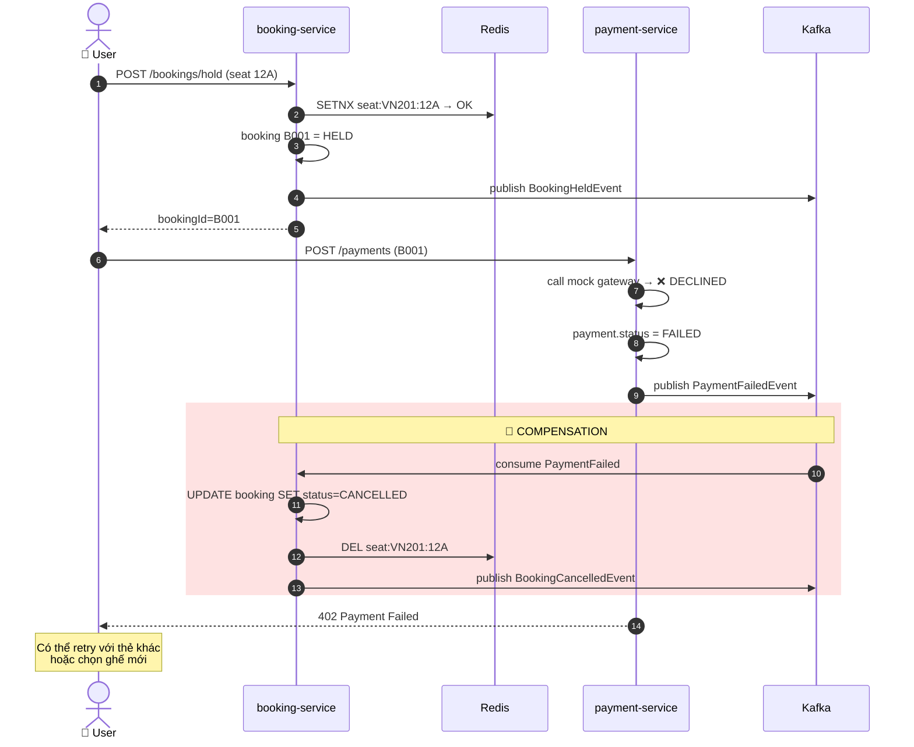
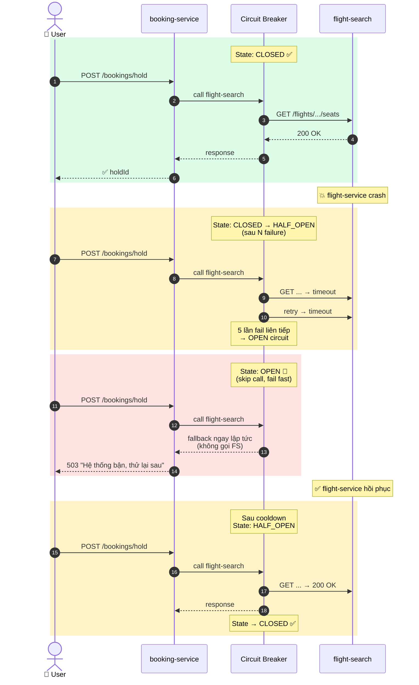
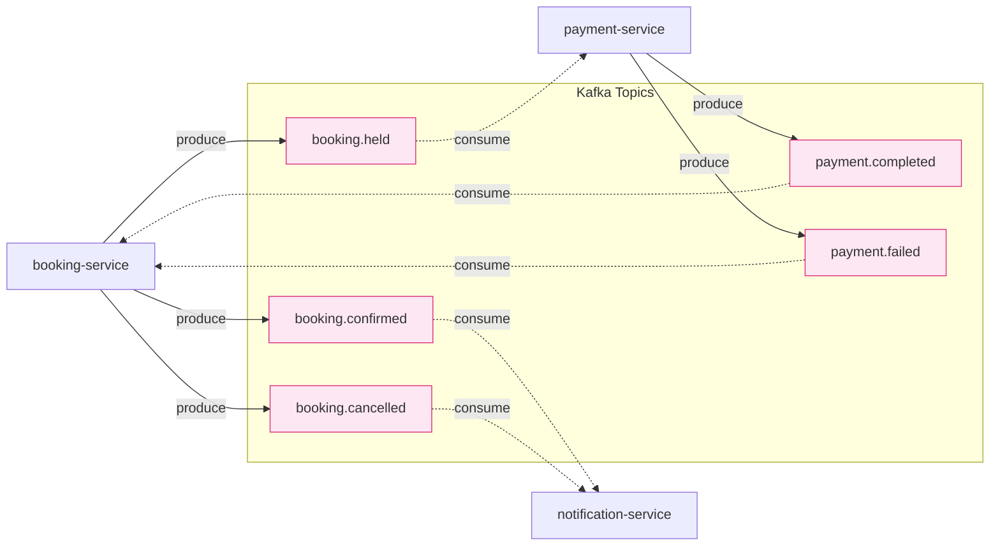
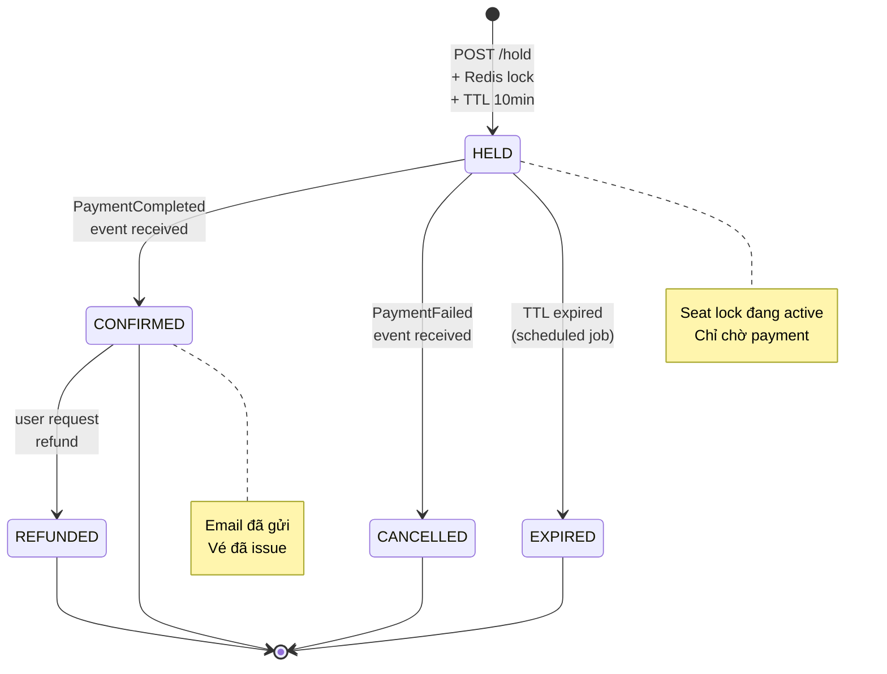
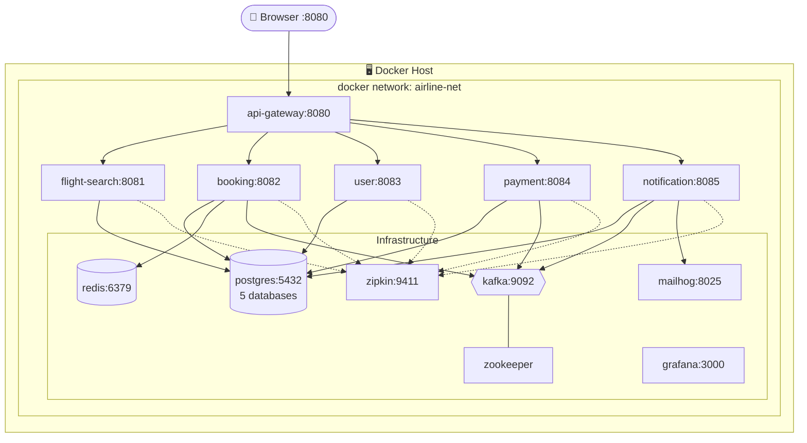

# Airline Booking System — Luồng & Kiến trúc

Tất cả sơ đồ vẽ bằng **Mermaid** — VS Code / GitHub / IntelliJ render trực tiếp được.

---

## 1. Sơ đồ tổng quan kiến trúc (Container Diagram)

---

## 2. Happy path — Đặt vé thành công (End-to-End)

---

## 3. Concurrency — 2 user cùng book 1 ghế (Race condition)

Đây là **challenge chính** của đề tài — phải đảm bảo chỉ 1 người thành công.

**Cơ chế chống double-book 2 lớp:**
1. **Redis SETNX** với TTL — lớp nhanh, in-memory
2. **DB unique constraint** `UNIQUE(flight_id, seat_no) WHERE status IN ('HELD','CONFIRMED')` — lớp backup

---

## 4. Saga — Payment fail → Compensation

Khi payment fail, hệ thống phải tự rollback (release ghế đã giữ).

**Choreography Saga** — không có orchestrator trung tâm, mỗi service tự phản ứng theo event.

---

## 5. Resilience — Circuit Breaker khi flight-search die

---

## 6. Data Flow — Event-driven

---

## 7. State Machine — Booking lifecycle

---

## 8. Triển khai — Docker Compose topology

---

## Tóm tắt các luồng chính

| # | Luồng                      | Service liên quan              | Đặc điểm                                      |
| - | -------------------------- | ------------------------------ | --------------------------------------------- |
| 1 | Đăng ký / Login            | user → gateway                 | Sync, JWT                                     |
| 2 | Tìm chuyến bay             | flight-search                  | Sync, read-heavy → có cache                   |
| 3 | Giữ ghế (hold)             | booking + flight-search        | Sync REST + Redis lock + DB                   |
| 4 | Thanh toán                 | payment                        | Sync vào, async publish event                 |
| 5 | Confirm booking            | booking ← Kafka ← payment      | **Async (Saga)**                              |
| 6 | Gửi email                  | notification ← Kafka ← booking | **Async (event-driven)**                      |
| 7 | Compensation khi fail      | booking ← Kafka ← payment      | **Saga rollback**                             |
| 8 | Race condition 2 user      | booking + Redis                | Concurrency control                           |

→ Tất cả 8 luồng đều đã được vẽ chi tiết ở các diagram phía trên.
