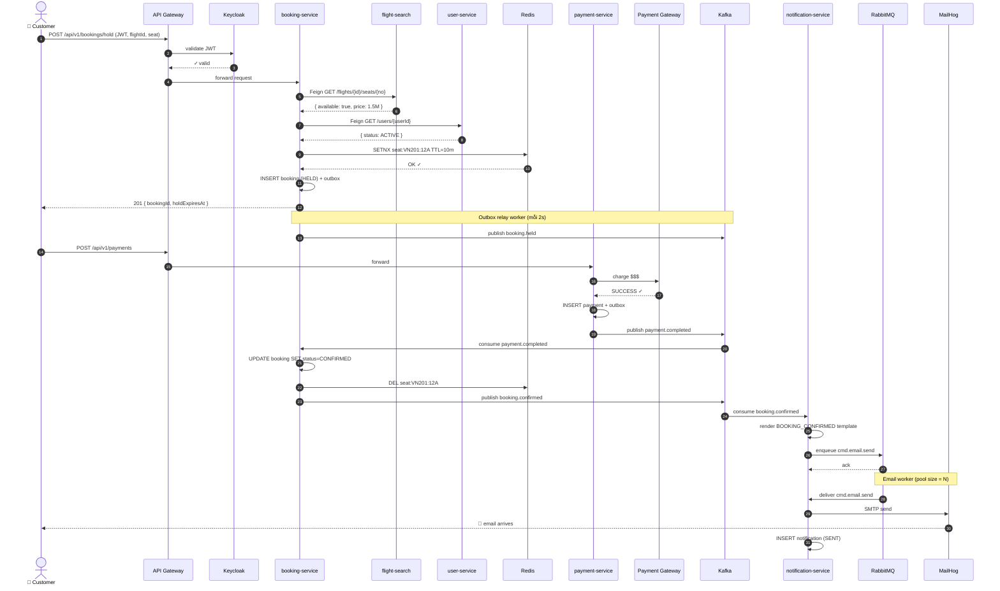

# Airline Booking System — Communication Diagram

**Use Case minh hoạ:** Customer đặt vé (Hold Seat → Pay → Confirm → Email) — Sync (REST/Feign solid) vs Async (Kafka/RabbitMQ dashed)

---

## 1. Diagram tổng quan

```mermaid
flowchart TB
    %% ──── Actors ────
    C([👤 Customer<br/>Web/Mobile])
    A([👨‍💼 Admin<br/>Portal])

    %% ──── Edge ────
    subgraph EDGE["🌐 Edge"]
        GW["<b>API GATEWAY</b><br/>Spring Cloud Gateway<br/><b>:8080</b><br/>Routing · JWT · CORS · RateLimit"]
    end

    %% ──── Cross-cutting Infrastructure ────
    subgraph XCUT["⚙️ Cross-cutting Infrastructure"]
        direction LR
        EUR["<b>Eureka</b><br/>:8761<br/>Service Registry<br/>(L7)"]
        CFG["<b>Config Server</b><br/>:8888<br/>Centralized Config<br/>(L9)"]
        KC["<b>Keycloak</b><br/>:8180<br/>Auth (JWT)<br/>(L12)"]
        ZIP["<b>Zipkin</b><br/>:9411<br/>Tracing<br/>(L15)"]
        GRAF["<b>Loki + Grafana</b><br/>:3000<br/>Logs + Metrics<br/>(L18)"]
    end

    %% ──── Services ────
    subgraph SVC["📦 Microservices"]
        direction LR
        FS["<b>flight-search-service</b><br/>:8081<br/>Aggregate: Flight,<br/>Route, Airport,<br/>SeatInventory<br/>(BRULE-PRICE)"]

        BK["<b>booking-service</b> ⭐<br/>:8082<br/>Aggregate: Booking<br/>Sub-entity: BookingItem<br/>State machine + Saga<br/>(BRULE-HOLD-10min)"]

        US["<b>user-service</b><br/>:8083<br/>Aggregate: User,<br/>Passenger<br/>JWT issuer"]

        PM["<b>payment-service</b><br/>:8084<br/>Aggregate: Payment,<br/>Transaction, Refund<br/>(Idempotency)"]

        NT["<b>notification-service</b><br/>:8085<br/>Aggregate: Notification,<br/>Template<br/>(EMAIL · SMS · PUSH)"]
    end

    %% ──── Message Broker ────
    KAFKA[["<b>Apache Kafka :9092</b><br/>Event Stream (1-to-many Pub/Sub) — L16<br/><br/>Topics:<br/>· booking.held · booking.confirmed · booking.cancelled<br/>· payment.completed · payment.failed · refund.completed<br/>· flight.price_changed"]]

    RABBIT[["<b>RabbitMQ :5672</b><br/>Command Queue (1-to-1) — L17<br/><br/>Queues:<br/>· cmd.email.send · cmd.sms.send<br/>· cmd.notify.flight_reminder"]]

    %% ──── Data Layer ────
    subgraph DATA["💾 Data Layer (Database-per-Service)"]
        direction LR
        DB1[("flight_db<br/>PostgreSQL<br/>airport, airline,<br/>route, flight,<br/>seat_inventory")]
        DB2[("booking_db<br/>PostgreSQL<br/>booking,<br/>booking_item,<br/>outbox_event")]
        DB3[("user_db<br/>PostgreSQL<br/>users, passenger,<br/>user_role")]
        DB4[("payment_db<br/>PostgreSQL<br/>payment, transaction,<br/>refund, outbox_event")]
        DB5[("notify_db<br/>PostgreSQL<br/>notification,<br/>template, reminder_log")]
        RD[("<b>Redis :6379</b><br/>Distributed lock<br/>seat-hold TTL")]
    end

    %% ──── External ────
    MAIL["<b>MailHog :8025</b><br/>SMTP (dev)<br/>SendGrid (prod)"]
    PAYGW["<b>Mock Payment</b><br/><b>Gateway</b><br/>random SUCCESS/FAIL"]

    %% ──── Connections ────
    C -->|HTTPS| GW
    A -->|HTTPS| GW

    %% Gateway → services (sync REST routing)
    GW ==>|"(2) route + JWT"| FS
    GW ==>|"(2) route + JWT"| BK
    GW ==>|"(2) route + JWT"| US
    GW ==>|"(2) route + JWT"| PM

    %% Sync inter-service (Feign)
    BK ==>|"(3) Feign GET<br/>flight availability"| FS
    BK ==>|"(4) Feign GET<br/>validate user"| US

    %% Service → DB
    FS --- DB1
    BK --- DB2
    BK --- RD
    US --- DB3
    PM --- DB4
    NT --- DB5

    %% Async Kafka publish/subscribe
    BK -.->|"(5) publish<br/>booking.held"| KAFKA
    PM -.->|"(7) publish<br/>payment.completed/failed"| KAFKA
    KAFKA -.->|"(8) consume<br/>payment.* → confirm/compensate"| BK
    BK -.->|"(9) publish<br/>booking.confirmed/cancelled"| KAFKA
    KAFKA -.->|"(10) consume<br/>booking.* → render template"| NT

    %% Async RabbitMQ command
    NT -.->|"(11) cmd.email.send"| RABBIT
    RABBIT -.->|"(12) consume command"| NT
    NT -->|"(13) send email via SMTP"| MAIL

    %% Payment to external
    PM -->|"(6) charge"| PAYGW

    %% Cross-cutting infra connections (dotted)
    FS & BK & US & PM & NT -.->|register| EUR
    FS & BK & US & PM & NT -.->|fetch config| CFG
    GW -.->|validate JWT| KC
    FS & BK & US & PM & NT -.->|trace span| ZIP
    FS & BK & US & PM & NT -.->|log + metrics| GRAF

    %% Styling
    classDef svc fill:#dbeafe,stroke:#2563eb,color:#1e3a8a,stroke-width:2px
    classDef db fill:#fef3c7,stroke:#d97706
    classDef broker fill:#1f2937,stroke:#000,color:#fff
    classDef edge fill:#fde68a,stroke:#b45309,stroke-width:2px
    classDef xcut fill:#ede9fe,stroke:#7c3aed
    classDef ext fill:#fce7f3,stroke:#db2777
    class FS,BK,US,PM,NT svc
    class DB1,DB2,DB3,DB4,DB5,RD db
    class KAFKA,RABBIT broker
    class GW edge
    class EUR,CFG,KC,ZIP,GRAF xcut
    class MAIL,PAYGW ext
```



---

## 2. Legend (giống TalentHub style)

| Notation                          | Ý nghĩa                                                        | Ví dụ                                              |
| --------------------------------- | -------------------------------------------------------------- | -------------------------------------------------- |
| ➡️ **Sync REST/Feign** (solid)    | Caller chờ response. Có timeout + Circuit Breaker.              | `booking → flight-search` validate seat            |
| ↘️ **Async Kafka (Event)** (dashed) | Fire-and-forget, 1-to-many Pub/Sub                              | `BookingConfirmed` event                           |
| ↗️ **Async RabbitMQ (Command)** (dashed) | Task queue 1-to-1, work distribution                         | `cmd.email.send`                                    |
| ⎯⎯⎯ **Service ↔ DB**              | Database-per-Service. Mỗi service sở hữu 1 DB, KHÔNG share     | booking ↔ booking_db                               |

**Màu service (theo bounded context):**
- 🟦 **Xanh dương:** flight-search, user (master data + identity)
- 🟩 **Xanh lá:** booking (Core domain) — ⭐ trung tâm
- 🟧 **Cam:** notification (Generic — SaaS-able)
- 🟪 **Tím:** payment (Supporting — có thể outsource)

---

## 3. Use Case Flow chi tiết — Customer books a flight

> **Kịch bản:** User đã login, đang ở trang chọn ghế chuyến VN201 ngày 30/06. User chọn ghế 12A và bấm "Tiếp tục thanh toán".

| Step | Action                                                                                                | Channel               | Service                          |
| ---- | ----------------------------------------------------------------------------------------------------- | --------------------- | -------------------------------- |
| (1)  | Customer `POST /api/v1/bookings/hold` qua HTTPS (kèm JWT)                                              | HTTPS                 | Browser → API Gateway            |
| (2)  | Gateway route request đến `booking-service` (validate JWT từ Keycloak, check rate-limit)              | Sync REST             | API Gateway → booking-service    |
| (3)  | booking-service gọi flight-search-service kiểm tra ghế 12A còn trống + lấy giá hiện tại (Feign)      | Sync REST (Feign)     | booking → flight-search          |
| (4)  | booking-service gọi user-service xác nhận user còn ACTIVE (Feign, có Circuit Breaker)                 | Sync REST (Feign)     | booking → user                   |
| (5)  | booking-service `SETNX seat:VN201:12A` lên Redis (TTL 10 phút), INSERT booking (HELD) + outbox event  | Service→DB + Redis    | booking → booking_db + Redis     |
| (5b) | Relay worker đọc outbox → publish `booking.held` lên Kafka                                            | Async Kafka (publish) | booking → Kafka                  |
| (6)  | Customer chuyển sang trang Payment, `POST /api/v1/payments` — payment-service gọi mock gateway        | Sync REST + HTTPS     | Customer → payment → Gateway     |
| (7)  | payment-service INSERT payment (SUCCESS) + outbox → publish `payment.completed` lên Kafka            | Async Kafka (publish) | payment → Kafka                  |
| (8)  | booking-service consume `payment.completed` → UPDATE booking SET status=CONFIRMED, `DEL` Redis lock  | Async Kafka (consume) | Kafka → booking                  |
| (9)  | booking-service publish `booking.confirmed` lên Kafka                                                  | Async Kafka (publish) | booking → Kafka                  |
| (10) | notification-service consume `booking.confirmed` → render template `BOOKING_CONFIRMED` từ notify_db   | Async Kafka (consume) | Kafka → notification             |
| (11) | notification-service đẩy command `cmd.email.send` (payload đã render) lên RabbitMQ                    | Async RabbitMQ (push) | notification → RabbitMQ          |
| (12) | Email worker consume command từ queue, lấy job đầu                                                    | Async RabbitMQ (pull) | RabbitMQ → notification (worker) |
| (13) | Worker gọi SMTP (MailHog dev / SendGrid prod) gửi email → INSERT notification log (SENT)              | External + Service→DB | notification → MailHog + notify_db |

### Trường hợp Compensation (Payment fail)

| Step  | Action                                                                                                | Channel                |
| ----- | ----------------------------------------------------------------------------------------------------- | ---------------------- |
| (7')  | Mock gateway trả về DECLINED → payment-service publish `payment.failed`                                | Async Kafka            |
| (8')  | booking-service consume → UPDATE booking SET status=CANCELLED, `DEL` Redis lock (release ghế)         | Async Kafka + Service→DB+Redis |
| (9')  | booking-service publish `booking.cancelled`                                                            | Async Kafka            |
| (10') | notification-service consume → đẩy email "thanh toán thất bại" qua RabbitMQ → SMTP                     | Kafka → RabbitMQ → SMTP|

---

## 4. Topics & Queues — danh mục đầy đủ

### Kafka Topics (event-driven, 1-to-many)

| Topic                  | Partition Key | Producer          | Consumer(s)               | Retention |
| ---------------------- | ------------- | ----------------- | ------------------------- | --------- |
| `booking.held`         | `bookingId`   | booking-svc       | (audit / analytics)        | 7d        |
| `booking.confirmed`    | `bookingId`   | booking-svc       | notification-svc           | 7d        |
| `booking.cancelled`    | `bookingId`   | booking-svc       | notification-svc           | 7d        |
| `payment.completed`    | `bookingId`   | payment-svc       | booking-svc                | 7d        |
| `payment.failed`       | `bookingId`   | payment-svc       | booking-svc, notification-svc | 7d     |
| `refund.completed`     | `bookingId`   | payment-svc       | booking-svc, notification-svc | 7d     |
| `flight.price_changed` | `flightId`    | flight-search-svc | (cache invalidation)        | 1d       |

### RabbitMQ Queues (task queue, 1-to-1)

| Queue                       | Producer          | Consumer(s)        | Purpose                                  |
| --------------------------- | ----------------- | ------------------ | ---------------------------------------- |
| `cmd.email.send`            | notification-svc  | email-worker (×N)  | Worker pool gửi email — scale ngang dễ   |
| `cmd.sms.send`              | notification-svc  | sms-worker         | (future) gửi SMS qua Twilio              |
| `cmd.notify.flight_reminder`| scheduler         | notification-svc   | Cron đẩy task gửi reminder trước bay 24h |

**Tại sao tách Kafka vs RabbitMQ?**

- **Kafka** = Event Stream (history, replay, multiple consumers cùng đọc) → cho domain event như `BookingConfirmed`
- **RabbitMQ** = Task Queue (1 worker pick 1 job, ack/nack, retry chuẩn) → cho command như `SendEmail`

---

## 5. Cross-cutting Infrastructure — chi tiết

| Layer | Component              | Port | Vai trò                                                                |
| ----- | ---------------------- | ---- | ---------------------------------------------------------------------- |
| L7    | **Eureka**             | 8761 | Service registry — services tự đăng ký, Gateway dùng client-side LB    |
| L9    | **Spring Config Server** | 8888 | Tập trung application config qua Git repo — đổi config không cần redeploy |
| L12   | **Keycloak**           | 8180 | Auth server, phát hành JWT, hỗ trợ OAuth2/OIDC                          |
| L15   | **Zipkin**             | 9411 | Distributed tracing — trace 1 request đi qua 5 service                  |
| L16   | **Apache Kafka**       | 9092 | Event stream — pub/sub                                                  |
| L17   | **RabbitMQ**           | 5672 | Task queue — command pattern                                            |
| L18   | **Loki + Grafana**     | 3000 | Logs aggregation + metrics dashboards                                   |

**MVP scope (Tuần 1–6):** Chỉ cần Postgres + Redis + Kafka + Zipkin. Eureka/Keycloak/Config Server/RabbitMQ/Loki có thể add ở Tuần 7–8 nếu còn thời gian.

---

## 6. Sơ đồ luồng (sequence) — Customer books a flight



---

## 7. So sánh với reference (TalentHub)

| Khía cạnh                | TalentHub                                  | Airline Booking System (ABS)                  |
| ------------------------ | ------------------------------------------ | --------------------------------------------- |
| Số service               | 5 (job, candidate, application, notif, cv-parser) | 5 (flight, booking, user, payment, notif)     |
| Core domain              | application-service (state machine pipeline) | booking-service (state machine HELD→CONFIRMED) |
| Sync inter-service       | application → job, candidate (Feign)        | booking → flight-search, user (Feign)         |
| Kafka events             | `candidate.cv_uploaded`, `application.created` | `booking.held/confirmed`, `payment.completed`  |
| RabbitMQ commands        | `send email command`                        | `cmd.email.send`, `cmd.sms.send`              |
| External storage         | MinIO (CV files)                            | (none — vé là digital, không file)            |
| External processing      | Apache Tika + skills NLP (cv-parser)        | Mock Payment Gateway (random success/fail)    |
| Distributed lock         | (không cần)                                 | **Redis SETNX** cho seat-hold ⭐               |
| Saga                     | (không có)                                  | **Choreography Saga** cho booking ↔ payment   |
| Database per service     | ✅                                          | ✅                                            |
| Cross-cutting infra      | Eureka, Config, Keycloak, Zipkin, Loki+Grafana | Tương tự                                     |

**Điểm khác biệt nổi bật của ABS** so với TalentHub (có thể nhấn mạnh trong báo cáo):

1. ⭐ **Distributed lock với Redis** — TalentHub không có concurrency challenge (mỗi candidate apply 1 job riêng), còn ABS phải chống tranh ghế.
2. ⭐ **Choreography Saga** — luồng booking ↔ payment có rollback compensation, TalentHub chỉ có pipeline forward.
3. ⭐ **Optimistic locking với `@Version`** — trên Flight, SeatInventory, Booking để chống lost update.
4. ⭐ **Outbox Pattern** — đảm bảo Kafka event không bị mất khi DB commit thành công.

---

## 8. Cách render diagram để paste vào Word

**Cách 1 — Mermaid Live (đơn giản, đẹp nhất):**

1. Copy đoạn code ```mermaid``` ở mục 1
2. Paste vào https://mermaid.live
3. Click "Actions → PNG / SVG" → download
4. Chèn vào Word section "System Architecture"

**Cách 2 — VS Code preview:**

1. Cài extension "Markdown Preview Mermaid Support"
2. Mở file `communication-diagram.md` → bấm preview (Ctrl+Shift+V)
3. Screenshot vùng diagram → paste Word

**Cách 3 — Vẽ lại bằng draw.io / Lucidchart:**

- Dùng đoạn này làm sketch → vẽ lại bằng draw.io để có icon đẹp như reference TalentHub
- Diagram trên đã có đầy đủ thông tin: services, ports, topics, queues, infra components, numbered steps → chỉ cần vẽ lại

Diagram trong file này có **đầy đủ thông tin tương đương** ảnh TalentHub bạn gửi: actors, gateway với routing/JWT/CORS/RateLimit, 5 services với aggregate roots, cross-cutting infrastructure đánh số layer, Kafka topics + RabbitMQ queues, DB-per-service, external systems, legend, và use case flow 13 bước.
