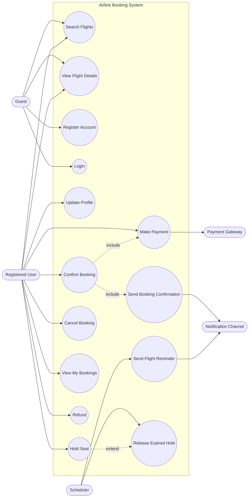
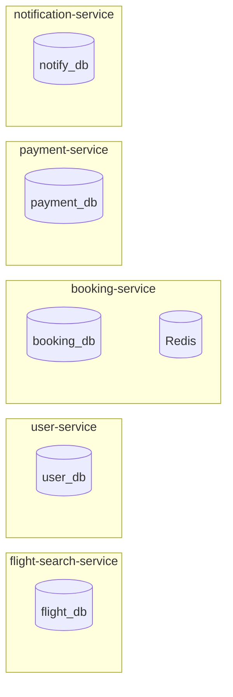
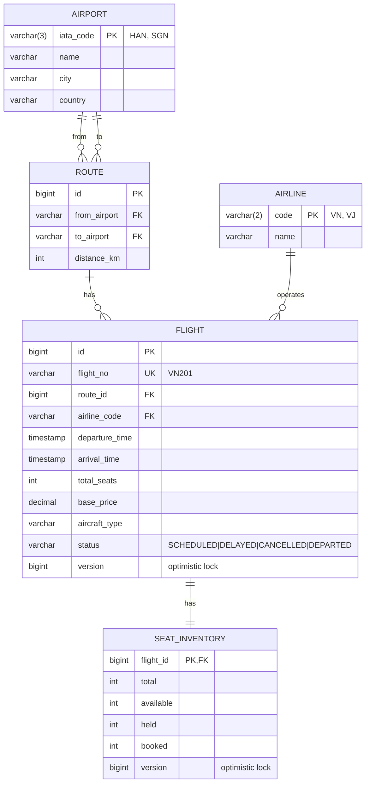
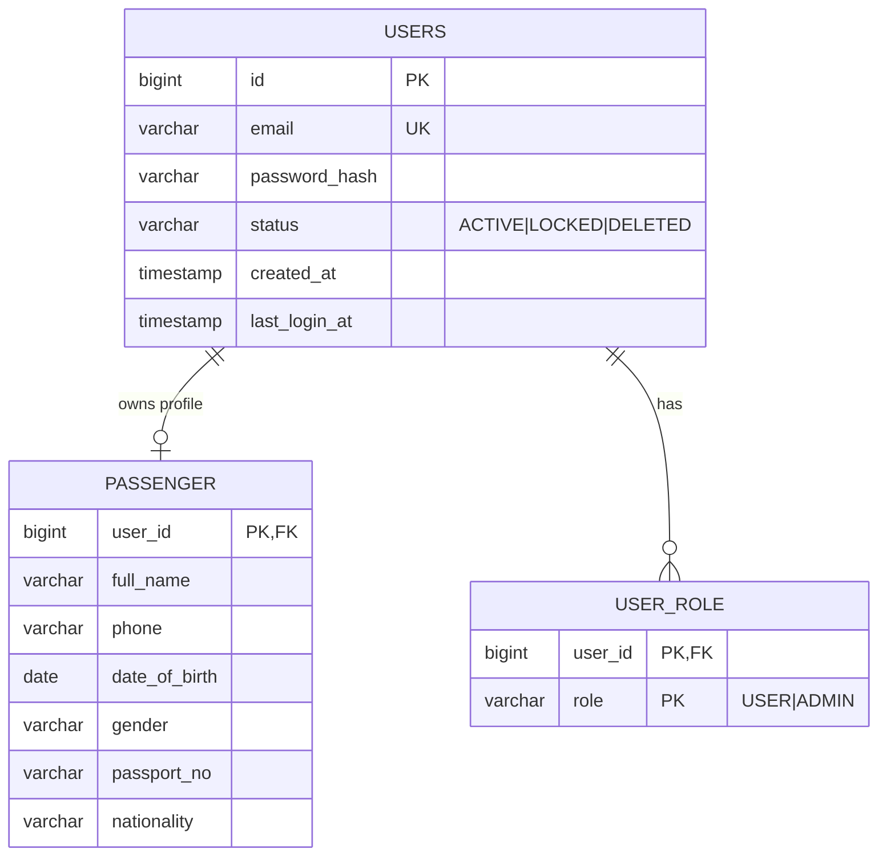
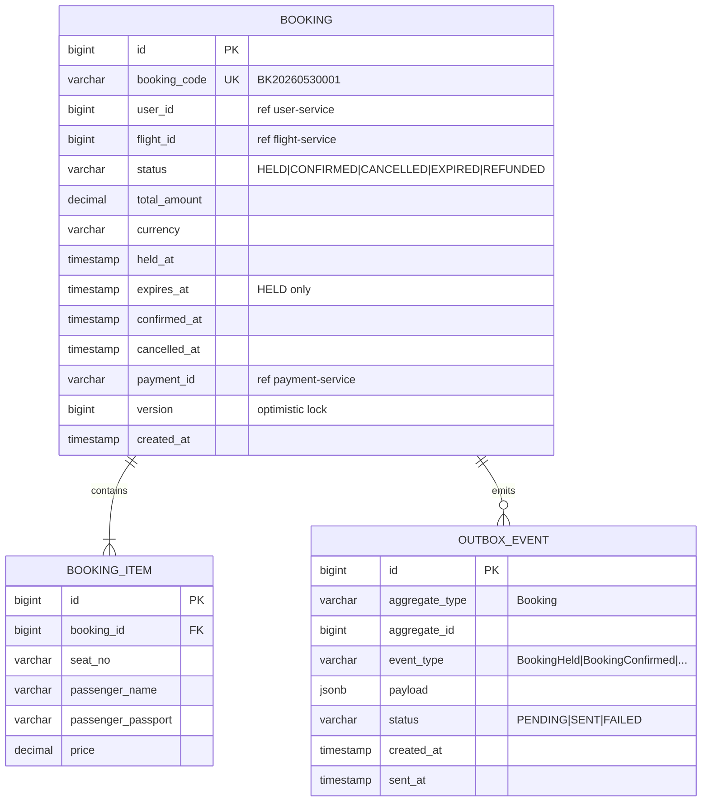
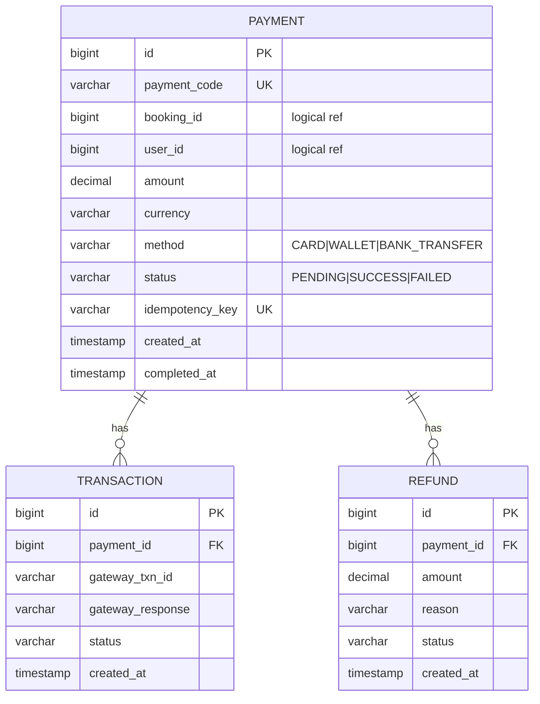
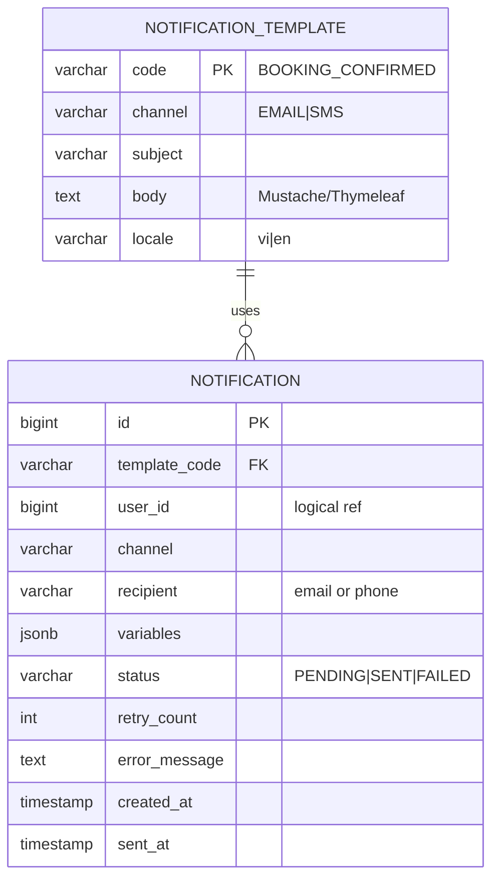

# Airline Booking System — Use Case & Database Design

Tài liệu thiết kế chi tiết: **use case** (actor / scenario / flow) + **database schema** (ERD + DDL từng service).

> Mỗi microservice sở hữu DB riêng (Database-per-Service pattern). Không service nào query thẳng DB của service khác — chỉ giao tiếp qua REST/Kafka.

---

## Phần I · Use Case Design

### 1. Actors

| Actor                 | Mô tả                                                                                  |
| --------------------- | -------------------------------------------------------------------------------------- |
| **Guest**             | Khách chưa đăng nhập, chỉ search được chuyến bay                                       |
| **Registered User**   | Hành khách đã có tài khoản → search, book, thanh toán, xem lịch sử                     |
| **Admin** *(opt)*     | Quản trị: thêm/sửa chuyến bay, route, xem báo cáo (ngoài scope MVP)                    |
| **Payment Gateway**   | Hệ thống external (mock) xử lý thanh toán                                              |
| **Notification Channel** | SMTP / SMS provider gửi email/SMS                                                   |
| **Scheduler**         | Cron job nội bộ — release seat hold hết hạn, gửi flight reminder                        |

### 2. Use Case Diagram (tổng quan)



### 3. Danh sách Use Case (chi tiết)

#### UC-01 · Search Flights

| Mục          | Nội dung                                                                              |
| ------------ | ------------------------------------------------------------------------------------- |
| Actor        | Guest, Registered User                                                                |
| Service      | flight-search-service                                                                 |
| Precondition | Có dữ liệu chuyến bay trong DB                                                        |
| Trigger      | User gọi `GET /api/v1/flights?from=HAN&to=SGN&date=2026-06-30&passengers=1`           |
| Main flow    | 1. Validate input (sân bay tồn tại, ngày ≥ hôm nay)<br/>2. Query Flight + Route theo điều kiện<br/>3. Filter chuyến còn ghế (available_seats > passengers)<br/>4. Tính giá hiện tại (base_price × pricing_factor)<br/>5. Return list FlightSummaryDTO |
| Alternative  | 3a. Không có chuyến → return empty list<br/>1a. Sân bay không tồn tại → 400 Bad Request |
| Postcondition| Không thay đổi state                                                                  |

#### UC-02 · Register Account

| Mục          | Nội dung                                                                              |
| ------------ | ------------------------------------------------------------------------------------- |
| Actor        | Guest                                                                                 |
| Service      | user-service                                                                          |
| Precondition | Email chưa tồn tại                                                                    |
| Trigger      | `POST /api/v1/users/register` (email, password, fullName, phone)                      |
| Main flow    | 1. Validate format email/phone/password strength<br/>2. Check email unique<br/>3. Hash password (BCrypt)<br/>4. INSERT user (status=ACTIVE)<br/>5. Tạo Passenger profile mặc định<br/>6. Return userId + JWT |
| Alternative  | 2a. Email đã tồn tại → 409 Conflict<br/>1a. Password yếu → 400                        |
| Postcondition| 1 row trong `users` + 1 row trong `passengers`                                        |

#### UC-03 · Hold Seat ⭐ (concurrency critical)

| Mục          | Nội dung                                                                              |
| ------------ | ------------------------------------------------------------------------------------- |
| Actor        | Registered User                                                                       |
| Service      | booking-service (gọi sync flight-search-service)                                      |
| Precondition | Đã login (JWT valid), ghế còn trống                                                   |
| Trigger      | `POST /api/v1/bookings/hold` (flightId, seatNo, passengerInfo)                        |
| Main flow    | 1. Validate JWT, parse userId<br/>2. Sync gọi flight-search-service: GET seat availability<br/>3. Lấy Redis lock: `SETNX seat:{flightId}:{seatNo}` TTL=10min<br/>4. INSERT booking (status=HELD, expiresAt=now+10min)<br/>5. INSERT booking_items với passenger info<br/>6. Publish event `BookingHeldEvent` (outbox)<br/>7. Return bookingId + holdExpiresAt |
| Alternative  | 3a. SETNX fail (đã có người giữ) → 409 SEAT_TAKEN<br/>2a. Flight không tồn tại → 404<br/>2b. Flight đã khởi hành → 400 |
| Postcondition| 1 row `bookings` (HELD) + Redis key có TTL 10 phút                                    |
| Concurrency  | Redis SETNX là **atomic** — chỉ 1 trong N request đồng thời thắng                     |

#### UC-04 · Make Payment & Confirm Booking

| Mục          | Nội dung                                                                              |
| ------------ | ------------------------------------------------------------------------------------- |
| Actor        | Registered User                                                                       |
| Service      | payment-service → (Kafka) → booking-service → (Kafka) → notification-service          |
| Precondition | Booking đang ở trạng thái HELD và chưa hết hạn                                        |
| Trigger      | `POST /api/v1/payments` (bookingId, amount, paymentMethod, idempotencyKey)            |
| Main flow    | 1. Check idempotencyKey chưa được dùng<br/>2. INSERT payment (status=PENDING)<br/>3. Gọi mock gateway → trả về SUCCESS<br/>4. UPDATE payment.status=SUCCESS<br/>5. Publish `PaymentCompletedEvent`<br/>6. booking-service consume → UPDATE booking.status=CONFIRMED, DEL Redis lock<br/>7. booking-service publish `BookingConfirmedEvent`<br/>8. notification-service consume → render template → gửi email |
| Alternative  | 3a. Gateway fail → publish `PaymentFailedEvent` → booking-service rollback (status=CANCELLED, release lock) — **Saga compensation** |
| Postcondition| booking.status = CONFIRMED, payment.status = SUCCESS, 1 email đã gửi                  |

#### UC-05 · Release Expired Hold (Scheduler)

| Mục          | Nội dung                                                                              |
| ------------ | ------------------------------------------------------------------------------------- |
| Actor        | Scheduler (Spring `@Scheduled`)                                                       |
| Service      | booking-service                                                                       |
| Precondition | Có booking HELD với expiresAt < now                                                   |
| Trigger      | Chạy mỗi 1 phút                                                                       |
| Main flow    | 1. SELECT bookings WHERE status=HELD AND expires_at < now()<br/>2. Với mỗi booking: UPDATE status=EXPIRED, DEL Redis key (an toàn nếu đã expire)<br/>3. Publish `BookingExpiredEvent` |
| Postcondition| Ghế được giải phóng, user khác có thể giữ                                             |

#### UC-06 · Cancel Booking

| Mục          | Nội dung                                                                              |
| ------------ | ------------------------------------------------------------------------------------- |
| Actor        | Registered User                                                                       |
| Service      | booking-service                                                                       |
| Precondition | Booking thuộc về user và status = HELD hoặc CONFIRMED                                 |
| Trigger      | `DELETE /api/v1/bookings/{id}`                                                        |
| Main flow    | 1. Validate ownership<br/>2. Nếu CONFIRMED: gọi payment-service refund → publish `RefundRequestedEvent`<br/>3. UPDATE booking.status=CANCELLED<br/>4. Release seat<br/>5. Publish `BookingCancelledEvent` → gửi email |
| Alternative  | 2a. Đã quá thời hạn refund → reject<br/>1a. Booking của user khác → 403                |

#### UC-07 · View My Bookings

| Mục          | Nội dung                                                                              |
| ------------ | ------------------------------------------------------------------------------------- |
| Actor        | Registered User                                                                       |
| Service      | booking-service                                                                       |
| Trigger      | `GET /api/v1/bookings/me?status=CONFIRMED`                                            |
| Main flow    | 1. Parse userId từ JWT<br/>2. SELECT bookings WHERE user_id = ? ORDER BY created_at DESC<br/>3. Cho mỗi booking, gọi flight-search-service để enrich thông tin chuyến bay (hoặc cache)<br/>4. Return list |

#### UC-08 · Send Flight Reminder (Scheduler)

| Mục          | Nội dung                                                                              |
| ------------ | ------------------------------------------------------------------------------------- |
| Actor        | Scheduler                                                                             |
| Service      | notification-service                                                                  |
| Trigger      | Chạy mỗi giờ                                                                          |
| Main flow    | 1. Query booking có departure trong 24h tới và chưa gửi reminder<br/>2. Render template<br/>3. Gọi SMTP/SMS<br/>4. INSERT notification log (channel, status, sentAt) |

### 4. Use Case Summary Table

| ID    | Use Case                  | Service                  | Actor          | Sync/Async       |
| ----- | ------------------------- | ------------------------ | -------------- | ---------------- |
| UC-01 | Search Flights            | flight-search            | Guest, User    | Sync             |
| UC-02 | Register / Login          | user                     | Guest          | Sync             |
| UC-03 | Hold Seat ⭐              | booking + flight-search  | User           | Sync + Redis     |
| UC-04 | Payment + Confirm         | payment + booking + notification | User   | Sync + Async Saga|
| UC-05 | Release Expired Hold      | booking                  | Scheduler      | Internal job     |
| UC-06 | Cancel Booking            | booking + payment        | User           | Sync + Async     |
| UC-07 | View My Bookings          | booking                  | User           | Sync             |
| UC-08 | Send Flight Reminder      | notification             | Scheduler      | Internal + Async |

---

## Phần II · Database Design

### 1. Tổng quan — Database-per-Service



**Chọn DB:** PostgreSQL 16 cho tất cả service (đơn giản, free, ACID, JSON support).

**Foreign key cross-service?** KHÔNG. Chỉ lưu `userId`, `flightId`, `bookingId` như **ID tham chiếu logic** (loosely coupled). Tham chiếu trong cùng DB thì mới dùng FK thật.

---

### 2. flight_db (flight-search-service)

#### ERD



#### DDL

```sql
CREATE TABLE airport (
    iata_code   VARCHAR(3)  PRIMARY KEY,
    name        VARCHAR(100) NOT NULL,
    city        VARCHAR(50)  NOT NULL,
    country     VARCHAR(50)  NOT NULL
);

CREATE TABLE airline (
    code        VARCHAR(2)  PRIMARY KEY,
    name        VARCHAR(100) NOT NULL
);

CREATE TABLE route (
    id              BIGSERIAL PRIMARY KEY,
    from_airport    VARCHAR(3) NOT NULL REFERENCES airport(iata_code),
    to_airport      VARCHAR(3) NOT NULL REFERENCES airport(iata_code),
    distance_km     INT,
    UNIQUE (from_airport, to_airport)
);

CREATE TABLE flight (
    id              BIGSERIAL PRIMARY KEY,
    flight_no       VARCHAR(10) NOT NULL UNIQUE,
    route_id        BIGINT NOT NULL REFERENCES route(id),
    airline_code    VARCHAR(2) NOT NULL REFERENCES airline(code),
    departure_time  TIMESTAMP NOT NULL,
    arrival_time    TIMESTAMP NOT NULL,
    total_seats     INT NOT NULL,
    base_price      DECIMAL(12,2) NOT NULL,
    aircraft_type   VARCHAR(20),
    status          VARCHAR(20) NOT NULL DEFAULT 'SCHEDULED',
    version         BIGINT NOT NULL DEFAULT 0,
    created_at      TIMESTAMP DEFAULT CURRENT_TIMESTAMP
);

CREATE INDEX idx_flight_search ON flight(route_id, departure_time);
CREATE INDEX idx_flight_status ON flight(status);

CREATE TABLE seat_inventory (
    flight_id   BIGINT PRIMARY KEY REFERENCES flight(id),
    total       INT NOT NULL,
    available   INT NOT NULL,
    held        INT NOT NULL DEFAULT 0,
    booked      INT NOT NULL DEFAULT 0,
    version     BIGINT NOT NULL DEFAULT 0,
    CHECK (available + held + booked = total)
);

-- Bảng map seat cụ thể (12A, 12B, ...) cho từng flight
CREATE TABLE flight_seat (
    flight_id   BIGINT NOT NULL REFERENCES flight(id),
    seat_no     VARCHAR(5) NOT NULL,
    class       VARCHAR(20) NOT NULL DEFAULT 'ECONOMY',  -- ECONOMY|BUSINESS|FIRST
    status      VARCHAR(20) NOT NULL DEFAULT 'AVAILABLE', -- AVAILABLE|HELD|BOOKED
    price_factor DECIMAL(4,2) DEFAULT 1.0,
    PRIMARY KEY (flight_id, seat_no)
);
```

---

### 3. user_db (user-service)

#### ERD



#### DDL

```sql
CREATE TABLE users (
    id              BIGSERIAL PRIMARY KEY,
    email           VARCHAR(100) NOT NULL UNIQUE,
    password_hash   VARCHAR(255) NOT NULL,
    status          VARCHAR(20) NOT NULL DEFAULT 'ACTIVE',
    created_at      TIMESTAMP DEFAULT CURRENT_TIMESTAMP,
    last_login_at   TIMESTAMP
);

CREATE INDEX idx_users_email ON users(email);

CREATE TABLE passenger (
    user_id         BIGINT PRIMARY KEY REFERENCES users(id) ON DELETE CASCADE,
    full_name       VARCHAR(100) NOT NULL,
    phone           VARCHAR(20),
    date_of_birth   DATE,
    gender          VARCHAR(10),     -- MALE|FEMALE|OTHER
    passport_no     VARCHAR(20),
    nationality     VARCHAR(3)        -- ISO country code
);

CREATE TABLE user_role (
    user_id     BIGINT NOT NULL REFERENCES users(id) ON DELETE CASCADE,
    role        VARCHAR(20) NOT NULL,
    PRIMARY KEY (user_id, role)
);
```

---

### 4. booking_db (booking-service) ⭐ core schema

#### ERD



#### DDL

```sql
CREATE TABLE booking (
    id              BIGSERIAL PRIMARY KEY,
    booking_code    VARCHAR(20) NOT NULL UNIQUE,
    user_id         BIGINT NOT NULL,        -- logical ref → user-service
    flight_id       BIGINT NOT NULL,        -- logical ref → flight-search-service
    status          VARCHAR(20) NOT NULL,
    total_amount    DECIMAL(12,2) NOT NULL,
    currency        VARCHAR(3) NOT NULL DEFAULT 'VND',
    held_at         TIMESTAMP,
    expires_at      TIMESTAMP,
    confirmed_at    TIMESTAMP,
    cancelled_at    TIMESTAMP,
    payment_id      VARCHAR(50),            -- logical ref → payment-service
    version         BIGINT NOT NULL DEFAULT 0,
    created_at      TIMESTAMP DEFAULT CURRENT_TIMESTAMP,
    CHECK (status IN ('HELD','CONFIRMED','CANCELLED','EXPIRED','REFUNDED'))
);

CREATE INDEX idx_booking_user      ON booking(user_id, created_at DESC);
CREATE INDEX idx_booking_status    ON booking(status);
CREATE INDEX idx_booking_expires   ON booking(expires_at) WHERE status = 'HELD';

CREATE TABLE booking_item (
    id                 BIGSERIAL PRIMARY KEY,
    booking_id         BIGINT NOT NULL REFERENCES booking(id) ON DELETE CASCADE,
    seat_no            VARCHAR(5) NOT NULL,
    passenger_name     VARCHAR(100) NOT NULL,
    passenger_passport VARCHAR(20),
    price              DECIMAL(12,2) NOT NULL
);

-- Đảm bảo 1 ghế trên 1 flight không bị book 2 lần (lớp DB backup)
CREATE UNIQUE INDEX uk_active_seat ON booking_item(booking_id, seat_no);

-- Outbox pattern — đảm bảo at-least-once delivery cho event
CREATE TABLE outbox_event (
    id             BIGSERIAL PRIMARY KEY,
    aggregate_type VARCHAR(50) NOT NULL,
    aggregate_id   BIGINT NOT NULL,
    event_type     VARCHAR(50) NOT NULL,
    payload        JSONB NOT NULL,
    status         VARCHAR(20) NOT NULL DEFAULT 'PENDING',
    created_at     TIMESTAMP DEFAULT CURRENT_TIMESTAMP,
    sent_at        TIMESTAMP,
    retry_count    INT DEFAULT 0
);

CREATE INDEX idx_outbox_pending ON outbox_event(status, created_at) WHERE status = 'PENDING';
```

#### Redis schema (booking-service)

| Key                                | Value                  | TTL    | Mục đích                       |
| ---------------------------------- | ---------------------- | ------ | ------------------------------ |
| `seat:{flightId}:{seatNo}`         | `{bookingId, userId}`  | 10min  | Lock ghế trong giai đoạn HELD  |
| `idempotency:{key}`                | `{bookingId}`          | 24h    | Chống double-submit            |
| `flight:price:{flightId}`          | `{currentPrice}`       | 5min   | Cache giá đã tính              |

---

### 5. payment_db (payment-service)

#### ERD



#### DDL

```sql
CREATE TABLE payment (
    id              BIGSERIAL PRIMARY KEY,
    payment_code    VARCHAR(30) NOT NULL UNIQUE,
    booking_id      BIGINT NOT NULL,
    user_id         BIGINT NOT NULL,
    amount          DECIMAL(12,2) NOT NULL,
    currency        VARCHAR(3) NOT NULL DEFAULT 'VND',
    method          VARCHAR(20) NOT NULL,
    status          VARCHAR(20) NOT NULL DEFAULT 'PENDING',
    idempotency_key VARCHAR(100) NOT NULL UNIQUE,
    created_at      TIMESTAMP DEFAULT CURRENT_TIMESTAMP,
    completed_at    TIMESTAMP,
    CHECK (status IN ('PENDING','SUCCESS','FAILED'))
);

CREATE INDEX idx_payment_booking ON payment(booking_id);
CREATE INDEX idx_payment_user    ON payment(user_id, created_at DESC);

CREATE TABLE transaction (
    id              BIGSERIAL PRIMARY KEY,
    payment_id      BIGINT NOT NULL REFERENCES payment(id),
    gateway_txn_id  VARCHAR(100),
    gateway_response TEXT,
    status          VARCHAR(20) NOT NULL,
    created_at      TIMESTAMP DEFAULT CURRENT_TIMESTAMP
);

CREATE TABLE refund (
    id              BIGSERIAL PRIMARY KEY,
    payment_id      BIGINT NOT NULL REFERENCES payment(id),
    amount          DECIMAL(12,2) NOT NULL,
    reason          VARCHAR(255),
    status          VARCHAR(20) NOT NULL DEFAULT 'PENDING',
    created_at      TIMESTAMP DEFAULT CURRENT_TIMESTAMP
);

-- Outbox cho payment events
CREATE TABLE outbox_event (
    id             BIGSERIAL PRIMARY KEY,
    aggregate_type VARCHAR(50) NOT NULL,
    aggregate_id   BIGINT NOT NULL,
    event_type     VARCHAR(50) NOT NULL,
    payload        JSONB NOT NULL,
    status         VARCHAR(20) NOT NULL DEFAULT 'PENDING',
    created_at     TIMESTAMP DEFAULT CURRENT_TIMESTAMP,
    sent_at        TIMESTAMP
);
```

---

### 6. notify_db (notification-service)

#### ERD



#### DDL

```sql
CREATE TABLE notification_template (
    code        VARCHAR(50) NOT NULL,
    locale      VARCHAR(5)  NOT NULL DEFAULT 'vi',
    channel     VARCHAR(10) NOT NULL,
    subject     VARCHAR(255),
    body        TEXT NOT NULL,
    PRIMARY KEY (code, locale, channel)
);

CREATE TABLE notification (
    id              BIGSERIAL PRIMARY KEY,
    template_code   VARCHAR(50) NOT NULL,
    user_id         BIGINT,
    channel         VARCHAR(10) NOT NULL,    -- EMAIL|SMS|PUSH
    recipient       VARCHAR(100) NOT NULL,
    variables       JSONB,
    status          VARCHAR(20) NOT NULL DEFAULT 'PENDING',
    retry_count     INT DEFAULT 0,
    error_message   TEXT,
    created_at      TIMESTAMP DEFAULT CURRENT_TIMESTAMP,
    sent_at         TIMESTAMP,
    CHECK (status IN ('PENDING','SENT','FAILED'))
);

CREATE INDEX idx_notif_user      ON notification(user_id, created_at DESC);
CREATE INDEX idx_notif_pending   ON notification(status) WHERE status = 'PENDING';

-- Tracking flight reminder để không gửi trùng
CREATE TABLE flight_reminder_log (
    booking_id  BIGINT PRIMARY KEY,
    flight_id   BIGINT NOT NULL,
    sent_at     TIMESTAMP NOT NULL
);
```

---

### 7. Cross-service ID conventions

| ID                | Format / Sinh ở đâu                  | Reference từ đâu                            |
| ----------------- | ------------------------------------ | ------------------------------------------- |
| `user_id`         | `BIGSERIAL` từ user-service          | booking, payment, notification (logical)    |
| `flight_id`       | `BIGSERIAL` từ flight-search         | booking (logical)                           |
| `booking_id`      | `BIGSERIAL` từ booking-service       | payment, notification (logical)             |
| `booking_code`    | `BK{yyyyMMdd}{seq}` — public-facing  | hiển thị cho user                           |
| `payment_code`    | `PM{yyyyMMdd}{seq}`                  | hiển thị cho user                           |
| `idempotency_key` | UUID do client sinh                  | chống double-submit payment                 |

---

## Phần III · Sample seed data (để demo)

```sql
-- flight_db
INSERT INTO airport VALUES
  ('HAN','Noi Bai International','Hanoi','VN'),
  ('SGN','Tan Son Nhat','Ho Chi Minh City','VN'),
  ('DAD','Da Nang International','Da Nang','VN');

INSERT INTO airline VALUES
  ('VN','Vietnam Airlines'),
  ('VJ','VietJet Air');

INSERT INTO route (from_airport, to_airport, distance_km) VALUES
  ('HAN','SGN',1166),
  ('SGN','HAN',1166),
  ('HAN','DAD',605);

INSERT INTO flight (flight_no, route_id, airline_code, departure_time, arrival_time, total_seats, base_price, aircraft_type)
VALUES
  ('VN201', 1, 'VN', '2026-06-30 06:00:00', '2026-06-30 08:15:00', 180, 1500000, 'A321'),
  ('VN203', 1, 'VN', '2026-06-30 09:30:00', '2026-06-30 11:45:00', 180, 1700000, 'A321'),
  ('VJ521', 1, 'VJ', '2026-06-30 14:00:00', '2026-06-30 16:10:00', 220, 1200000, 'A320');

INSERT INTO seat_inventory(flight_id, total, available) VALUES (1,180,180),(2,180,180),(3,220,220);
```

---

## Phần IV · Mapping Use Case ↔ Tables

| Use Case        | Tables involved (write)                          | Events published                         |
| --------------- | ------------------------------------------------ | ---------------------------------------- |
| UC-01 Search    | (read only)                                      | —                                        |
| UC-02 Register  | `users`, `passenger`, `user_role`                | `UserRegisteredEvent`                    |
| UC-03 Hold Seat | `booking`, `booking_item`, `outbox_event`, Redis | `BookingHeldEvent`                       |
| UC-04 Payment   | `payment`, `transaction`, `outbox_event` (PM); `booking` UPDATE (BK); `notification` (NT) | `PaymentCompletedEvent`, `BookingConfirmedEvent` |
| UC-05 Expire    | `booking`, `outbox_event`                        | `BookingExpiredEvent`                    |
| UC-06 Cancel    | `booking`, `refund`, `outbox_event`              | `BookingCancelledEvent`, `RefundRequestedEvent` |
| UC-07 View      | (read only)                                      | —                                        |
| UC-08 Reminder  | `notification`, `flight_reminder_log`            | —                                        |

---

## Phần V · Open questions (cần chốt với team)

1. **Authentication:** JWT stateless hay session-based? → đề xuất JWT (đơn giản, không cần share session store giữa services)
2. **Seat selection UI:** cho user chọn ghế cụ thể hay random? → đề xuất cho chọn (challenge concurrency rõ hơn)
3. **Pricing fluctuation:** dynamic price tính như thế nào? → đề xuất: `current_price = base_price × (1 + 0.1 × (seats_booked / total_seats))` — càng đầy càng đắt
4. **Refund policy:** trước 24h được full refund, trong 24h chỉ 50%?
5. **Multi-leg flight:** có hỗ trợ transit (HAN→SGN→BKK) không? → MVP đề xuất KHÔNG
6. **Loyalty / voucher:** ngoài scope MVP
